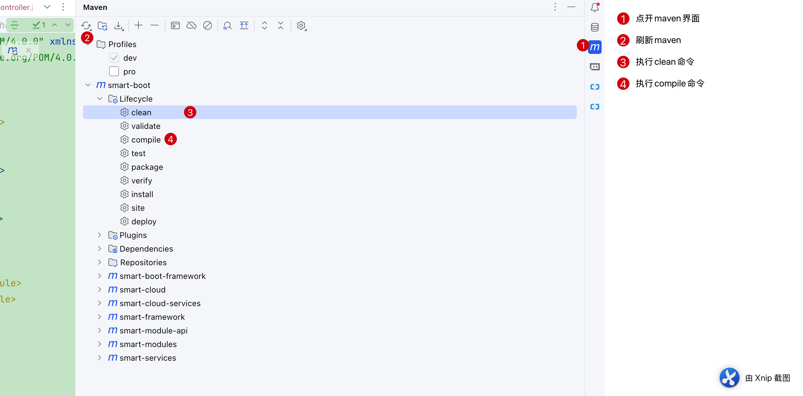
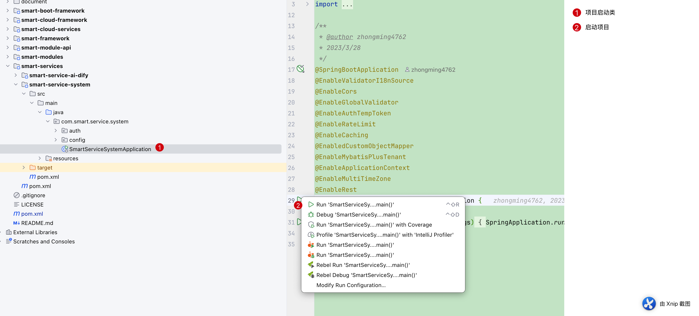

# 快速开始 {#quick-start}

本文介绍如何在本地启动 Smart Boot 单体版后端。零基础开发人员建议先完成单体版启动；微服务版还需要 Nacos、网关和多个服务，不在本文范围内。

## 一、准备开发环境

请先安装以下工具和服务：

- [JDK 25](https://www.oracle.com/java/technologies/downloads/)
- [Git](https://git-scm.com/)
- [Maven](https://maven.apache.org/download.cgi) 3.9+
- [PostgreSQL](https://www.postgresql.org/download/) 12+
- [Redis](https://redis.io/docs/latest/operate/oss_and_stack/install/install-redis/) 5.0+
- [IntelliJ IDEA](https://www.jetbrains.com/idea/download/)（推荐，使用命令行启动时可不安装）

打开终端并执行以下命令，确认 Java、Git 和 Maven 已经安装：

```bash
java -version
git -v
mvn -v
```

请重点确认 `java -version` 和 `mvn -v` 显示的 Java 版本均为 25。两处版本不一致时，应先修正 `JAVA_HOME` 或 Maven 使用的 JDK。

同时确认 PostgreSQL 和 Redis 服务已经启动。默认开发配置使用：

| 服务 | 默认地址 | 用途 |
| --- | --- | --- |
| PostgreSQL | `localhost:5432` | 保存系统业务数据 |
| Redis | `localhost:6379` | 保存认证和缓存数据 |

## 二、获取源码

在准备存放代码的目录中打开终端，执行：

```bash
git clone https://codeup.aliyun.com/6497f4a8d2963c5649be7c62/smart-framework/smart-boot.git
cd smart-boot
```

如果克隆时提示没有权限，请先确认当前账号已经获得 Codeup 项目访问权限，并按照终端提示完成登录。

## 三、初始化数据库

### 1. 创建数据库

使用 PostgreSQL 客户端连接本地数据库，创建名称为 `smart-boot` 的数据库。也可以在终端执行：

```bash
createdb -U postgres smart-boot
```

### 2. 导入初始化脚本

项目根目录的 `document/init_pg.sql` 包含建表和初始化数据。可以使用数据库管理工具打开并执行该文件，也可以在项目根目录执行：

```bash
psql -U postgres -d smart-boot -f document/init_pg.sql
```

命令执行完成且没有错误后，确认 `smart-boot` 数据库中已经生成数据表。

### 3. 检查连接配置

打开配置文件：

```text
smart-services/smart-service-system/src/main/resources/application-dev.yml
```

找到 `spring.datasource`，将数据库地址、用户名和密码修改为自己的 PostgreSQL 配置；Redis 不使用默认地址时，同时修改 `spring.data.redis`。

::: warning 配置安全

开发环境密码不要直接用于共享或生产环境，也不要把个人密码提交到 Git 仓库。

:::

## 四、编译项目

确认终端位于包含根 `pom.xml` 的 `smart-boot` 目录，然后执行：

```bash
mvn clean install -DskipTests
```

第一次编译需要下载较多依赖，耗时会比较长。终端最后出现下面的内容表示编译成功：

```text
BUILD SUCCESS
```

::: tip Maven 配置

项目 `pom.xml` 已声明构建需要的仓库。如果依赖下载失败，请检查 Maven `settings.xml` 中配置的镜像是否屏蔽了项目仓库，然后重新加载 Maven 项目。

:::

## 五、启动后端

### 方式一：使用 IntelliJ IDEA（推荐）

1. 使用 IDEA 打开后端项目根目录；
2. 将 Project SDK 和 Maven Runner JRE 设置为 JDK 25；
3. 等待 IDEA 完成 Maven 项目导入；
4. 在 Maven 工具窗口确认 `dev` Profile 已选中；
5. 打开启动类 `smart-services/smart-service-system/src/main/java/com/smart/service/system/SmartServiceSystemApplication.java`；
6. 点击 `main` 方法旁的运行按钮，选择运行 `SmartServiceSystemApplication`。





### 方式二：使用命令行

完成上一节的 Maven 编译后，在项目根目录执行：

```bash
java -jar smart-services/smart-service-system/target/smart-service-system-*.jar --spring.profiles.active=dev
```

当终端没有错误，并出现应用已启动的日志时，后端会监听：

```text
http://localhost:8080
```

可以在浏览器地址栏输入 `http://localhost:8080/doc.html`。能够打开接口文档页面，表示后端已经可以接收 HTTP 请求。

## 六、启动前端并登录

后端启动成功后，继续按照[前端项目快速开始](../../guide/introduction/quick-start.md)启动前端，然后访问 `http://localhost:5666`。

开发环境默认账号为：

```text
账号：admin
密码：SMARTboot&71264#@
```

::: warning 账号安全

默认账号密码仅用于本地开发环境。部署到共享或生产环境前，必须修改默认密码。

:::

## 七、停止项目

- IDEA 启动：点击运行窗口中的停止按钮；
- 命令行启动：回到运行后端的终端窗口，按 `Ctrl+C`。

## 八、常见问题

### 编译提示 Java 版本不支持

分别执行 `java -version` 和 `mvn -v`，确认命令行和 Maven 使用的都是 JDK 25。IDEA 用户还需要检查 Project SDK 和 Maven Runner JRE。

### Maven 依赖下载失败

检查网络连接和 Maven `settings.xml`。如果配置了全局镜像，确认该镜像能够访问项目 `pom.xml` 中声明的仓库，然后在 IDEA 中重新加载 Maven，或重新执行构建命令。

### 提示数据库连接失败

依次确认 PostgreSQL 已启动、`smart-boot` 数据库已经创建、初始化 SQL 已导入，以及 `application-dev.yml` 中的地址、用户名和密码正确。

### 提示 Redis 连接失败

确认 Redis 已启动并监听 `6379` 端口。如果 Redis 设置了密码或使用其他端口，需要同步修改 `application-dev.yml`。

### 8080 端口被占用

关闭占用该端口的程序后重新启动，或者修改 `smart-services/smart-service-system/src/main/resources/application.yml` 中的 `server.port`。修改端口后，还需要同步修改前端代理地址。
